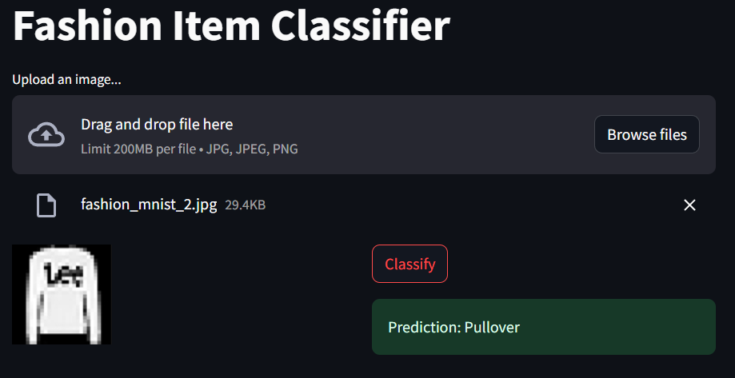

# Fashion Item Classifier

This project is a **Fashion Item Classifier** web app built using **Streamlit**. The model used in the app is a Convolutional Neural Network (CNN) that classifies fashion items from the **Fashion MNIST dataset**. The model has been trained using TensorFlow and achieves **90.16% validation accuracy**.

## Project Overview

This app allows users to upload images of fashion items (e.g., shirts, shoes, coats) and predicts the category of the item. The model is pre-trained and supports 10 classes from the **Fashion MNIST** dataset, including categories such as **T-shirt/top, Trouser, Pullover, Dress, Coat, Sneaker, Sandal, Shirt, Bag, and Ankle boot**.


## Features

- Upload fashion item images in **jpg, jpeg, or png** format.
- Image preprocessing is handled by resizing the image to the input size required by the model (28x28), and converting it to grayscale.
- The uploaded image is displayed to the user.
- On clicking the "Classify" button, the model makes predictions and displays the category of the item.

## Classes

The model predicts the following fashion categories:

1. T-shirt/top
2. Trouser
3. Pullover
4. Dress
5. Coat
6. Sandal
7. Shirt
8. Sneaker
9. Bag
10. Ankle boot

## Installation

To run this app locally, follow these steps:

1. Clone this repository to your local machine:
   ```bash
   git clone https://github.com/yourusername/fashion-item-classifier.git
   ```

2. Navigate to the project directory:
   ```bash
   cd fashion-item-classifier
   ```

3. Create a virtual environment and activate it (optional but recommended):
   ```bash
   python3 -m venv env
   source env/bin/activate  # On Windows use `env\Scripts\activate`
   ```

4. Install the required dependencies:
   ```bash
   pip install -r requirements.txt
   ```

5. Run the Streamlit app:
   ```bash
   streamlit run app/main.py
   ```

6. Upload a fashion item image, and click on "Classify" to see the model's prediction. (You can find some sample images in the `test_images` directory)

## Model Overview

The Convolutional Neural Network (CNN) used in this project is designed to classify images from the Fashion MNIST dataset. Below is the architecture of the model:

### Convolutional Layers
- **Conv2D(32, (3, 3), activation='relu')**: Extracts features from input images.
- **MaxPooling2D(2, 2)**: Reduces the dimensionality of feature maps, improving computation efficiency.
- **Conv2D(64, (3, 3), activation='relu')**: Further feature extraction.
- **MaxPooling2D(2, 2)**: Another down-sampling operation.
- **Conv2D(64, (3, 3), activation='relu')**: Final convolutional layer for feature extraction.

### Dense Layers
- **Flatten()**: Flattens the feature maps to pass into dense layers.
- **Dense(64, activation='relu')**: A fully connected layer with ReLU activation for classification.
- **Dense(10)**: Output layer with 10 neurons representing the 10 classes of the Fashion MNIST dataset.

### Compilation and Training
The model is compiled with the following parameters:
```python
model.compile(optimizer='adam',
              loss=tf.keras.losses.SparseCategoricalCrossentropy(from_logits=True),
              metrics=['accuracy'])
```

- **Optimizer**: Adam, a popular optimization algorithm.
- **Loss Function**: Sparse Categorical Crossentropy, suitable for multi-class classification.
- **Accuracy**: Used to evaluate the model's performance.

The model was trained on the Fashion MNIST dataset, achieving a validation accuracy of **90.16%** and a validation loss of **27%**.

## Dataset

The **Fashion MNIST** dataset consists of 70,000 grayscale images of 28x28 pixels each. The dataset contains 60,000 training images and 10,000 test images in 10 different classes. It is a widely used benchmark for image classification tasks.

## Dockerizing the app on Docker Hub

- The image is publicaly available on the Hub, for easy-to-use app with a pre trained model. With, reproducible environment across different platforms, scalability, version control and CI/CD ready capabilities.


## Future Improvements

- Allow the model to handle RGB images natively without converting to grayscale.
- Add functionality for real-time image capture and classification.
- Improve model accuracy by experimenting with different architectures, such as deeper networks or transfer learning.
  
## References

- [TensorFlow Fashion MNIST Dataset](https://www.tensorflow.org/datasets/catalog/fashion_mnist)
- [Streamlit Documentation](https://docs.streamlit.io/)


